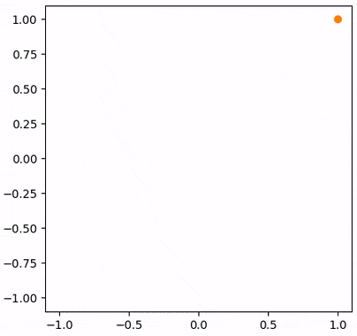

# iftopt

An Implicit Function Theorem (IFT) optimizer for bi-level optimizations.

## Requirements

* Python 3.7+
* PyTorch 1.x

## Installation

```bash
$ pip install git+https://github.com/money-shredder/iftopt.git
```

## Usage

Assuming a bi-level optimization of the form:
> `y*` = argmin_{`y`} val_loss(`x*`, `y`),
> where `x*` = argmin_{`x`} train_loss(`x`, `y`).

To solve for the optimal `x*` and `y*`
in the optimization problem,
we can implement the following with `iftopt`:
```python
from iftopt import HyperOptimizer
train_lr = val_lr = 0.1
# parameter to minimize the training loss
x = torch.nn.Parameter(...)
# hyper-parameter to minimize the validation loss
y = torch.nn.Parameter(...)
# training loss optimizer
opt = torch.optim.SGD([x], lr=train_lr)
# validation loss optimizer
hopt = HyperOptimizer(
    [y], torch.optim.SGD([y], lr=val_lr), vih_lr=0.1, vih_iterations=5)
# outer optimization loop for y
for _ in range(...):
    # inner optimization loop for x
    for _ in range(...):
        z = train_model(x, y)
        # inner optimization step for x
        opt.zero_grad()
        z.backward()
        opt.step()
    # outer optimization step for y
    hopt.set_train_parameters([x])
    z = train_model(x, y)
    hopt.train_step(z)
    v = val_model(x, y)
    hopt.val_step(v)
    hopt.grad()
    hopt.step()
```

For a concrete simple example,
please check out and run [`demo.py`](demo.py),
where `train_loss = lambda x, y: x ** 2 + y ** 2`
and `val_loss = lambda x, y: x ** 2`
with `x = y = 1.0` initially.
Even though the hyper-parameter `y`
does not have a gradient w.r.t. the validation loss,
`iftopt` can still minimize the validation loss.
It will generate a video `demo.avi`
following the optimization trajectory
as shown in the animation below:

